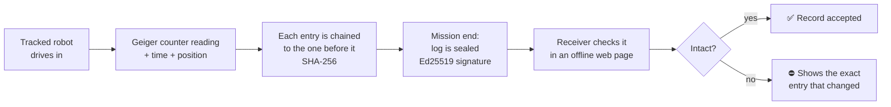

# RadWitness

**A low-cost radiation inspection robot that goes in instead of a person — and keeps a record that cannot be quietly changed.**

> Prototype · Security & Innovation Fair (SAIF) 2026 · Team: Mohammed M. Al-Sharif, Mohammed A. Al-Rashed

---

## The problem

Radioactive sources are used every day in industry, medicine and research. When control over a source is lost, it becomes an *orphan source* and can end up in scrap metal or inside a shipping container. The IAEA incident database lists 4,626 incidents since 1993.

Two problems show up every time someone has to check for radiation:

1. **A person has to stand close** to a possible source with a handheld meter.
2. **The readings end up in records that can be edited afterwards.**

## Where RadWitness is used

- Routine inspection of facilities that use radioactive materials
- Emergency response
- Searching scrap piles and containers for lost sources

## How it works

1. **Access** — a tracked chassis for uneven ground. A 360° LiDAR lets the robot drive itself and avoid obstacles all around it, even in the dark. It can also be driven remotely.
2. **Measure** — a Geiger–Müller counter takes the readings.
3. **Locate** — every reading is saved with its time and the robot's position. Heading comes from the gyroscope, because tracks slip when turning.
4. **Record & seal** — every reading becomes a log entry linked to the one before it. At the end of the mission the whole log is digitally signed.
5. **Verify** — the receiver opens one web page that works offline, picks the robot (its public key is registered in advance) and drops in the log and its seal. The page recomputes every fingerprint and checks the signature. The file never leaves the receiver's device.

### What the record proves — and what it does not

| Proves | Does not prove |
|---|---|
| The log was not changed after it was sealed | That the sensor itself read correctly |
| Exactly which entry changed, if one did | That the key holder did not build a new log — unless the chain head is sent to the receiver at sealing time (planned) |
| That it was sealed with this robot's key | |

This is **not a blockchain**. It is a chain of fingerprints sealed with a digital signature, on a single device, with no network needed.

## Hardware

| Part | Role |
|---|---|
| Waveshare UGV01 tracked chassis (ESP32 driver board) | Movement, wheel encoders, IMU |
| Raspberry Pi | Main computer: logging, sealing, control |
| RPLIDAR C1 (360°) | Obstacle detection and autonomous driving |
| Geiger–Müller counter (J305 tube) | Radiation readings |
| Camera | Visual confirmation |

## Measured results

All numbers below were measured on the real hardware or by running the real software.

**Robot platform**

| Test | Result |
|---|---|
| 360° LiDAR | 10.29 scans per second, ~500 points per scan (one every 0.72°), health "Good" |
| Turning repeatability | 5 turns, spread 0.55° |
| Track slip | gyro-to-track ratio 0.708–0.715 at 3 speeds (steady, so heading is taken from the gyroscope) |
| Robot–computer link | 10 of 10 replies |
| Autonomous driving | LiDAR-based obstacle avoidance running on the robot |

**Record integrity**

| Test | Result |
|---|---|
| Random edits detected (3 sealed logs × 1,000 edits) | 2,996 of 3,000 — every detected edit traced to the correct entry |
| The 4 undetected edits | only turned a space between fields into a tab or line break; no value changed |
| False alarms on untouched logs | 0 of 100 |
| Browser verifier vs. Python tool | 156 of 156 identical results |
| Network requests during verification | 0 |

## What is in this repository

| Folder | Contents |
|---|---|
| [`verifier/`](verifier/) | `radwitness.py` — build, seal and verify a mission log from the command line |
| [`robot/`](robot/) | `test_c1.py` — LiDAR check · `lidar_teleop.py` — live LiDAR view + driving from a browser |
| [`pi/`](pi/) | Robot software (Raspberry Pi): navigation, sensors, safety layer and web interface |

The offline web verifier page is being added.

The radiation source-localization layer is not included in this public version; its modules are placeholders.

## Safety

- The robot moves only while a command keeps arriving; if the link drops it stops by itself.
- No radioactive source is handled in the demonstrations. Calibration work is done only in licensed facilities by licensed staff.

## Roadmap

- Test with radioactive sources other than Cs-137
- Larger and more cluttered field tests
- Keep the signing key on the robot and send the chain head to the receiver at sealing time
- Add the offline web verifier to this repository

---

## نبذة بالعربي

**RadWitness** روبوت مجنزر منخفض التكلفة يدخل أماكن الإشعاع بدل الإنسان: في تفتيش المنشآت، وحالات الطوارئ، والبحث عن المصادر المشعة الضائعة في الخردة والحاويات. يقود نفسه بليدار 360° حتى في الظلام، ويقيس بعداد جايجر.

كل قراءة تُحفظ مع وقتها وموقع الروبوت، وتُربط بالقراءة التي قبلها، وفي نهاية المهمة يُختم السجل رقمياً. والمستلم يتحقق منه بصفحة تعمل بدون إنترنت: إذا تغيّرت أي قيمة بعد الختم، تنكشف ويظهر السطر الذي تغيّر بالضبط.

---

© 2026 the authors. All rights reserved.
